## dataGrip安装手册

### 1. 解压

 

在资料中已经提供了 datagrip 压缩包，需要将其复制到自己的软件安装目录下，比如: E:/develop/ 目录。然后执行解压，解压出来的目录如下： 

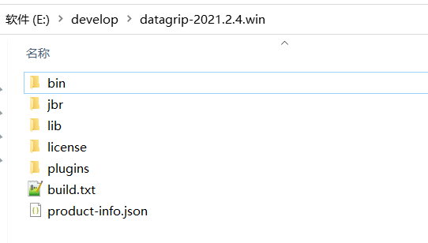  

### 2. 运行

#### 2.1 创建桌面快捷方式

进入解压后的bin目录，选择 datagrip64.exe，然后右键，选择 发送到 ---》 桌面快捷方式。

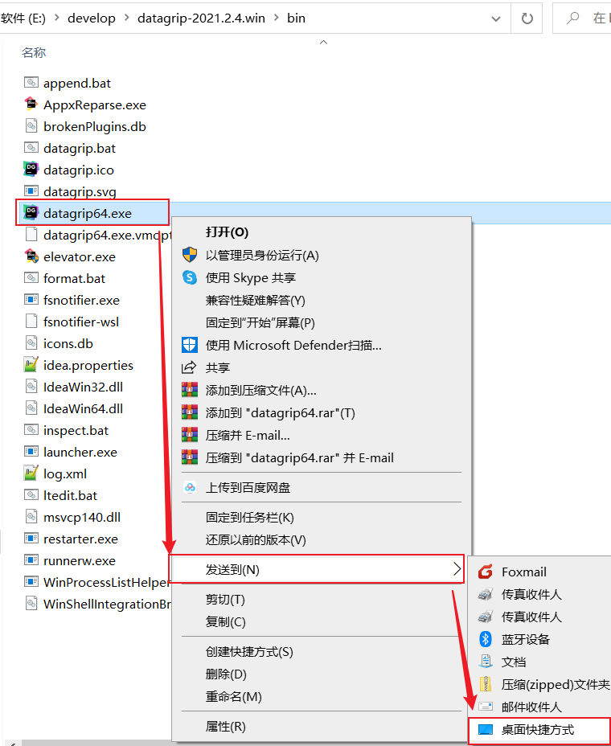  

#### 2.2 运行dataGrip

双击 datagrip64.exe ，运行。 **运行之后， 会显示需要注册账号登录，才可以试用。 所以我们需要注册一个账号，然后登录，登录完成之后。**

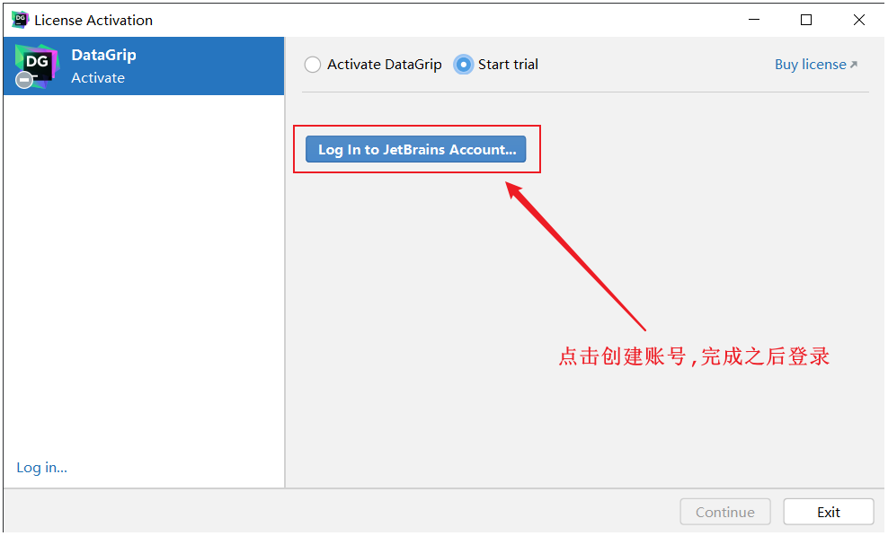 

选择 Start trial 试用。

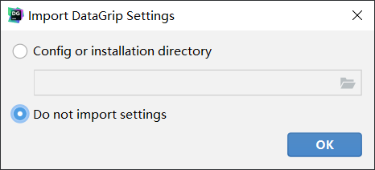  

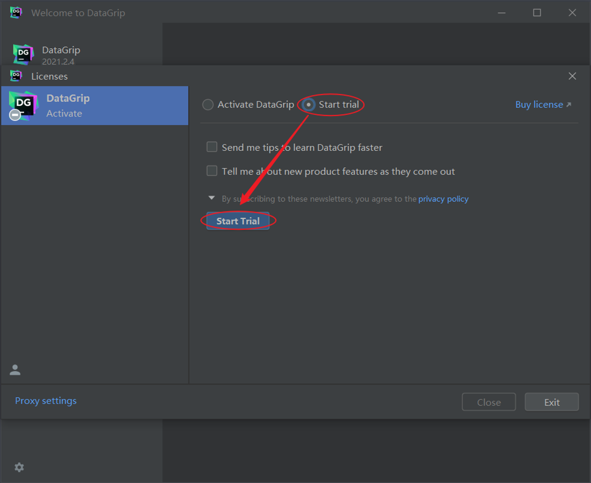 

选择创建一个新项目 New Project，指定工程的名称（自己随意起）。

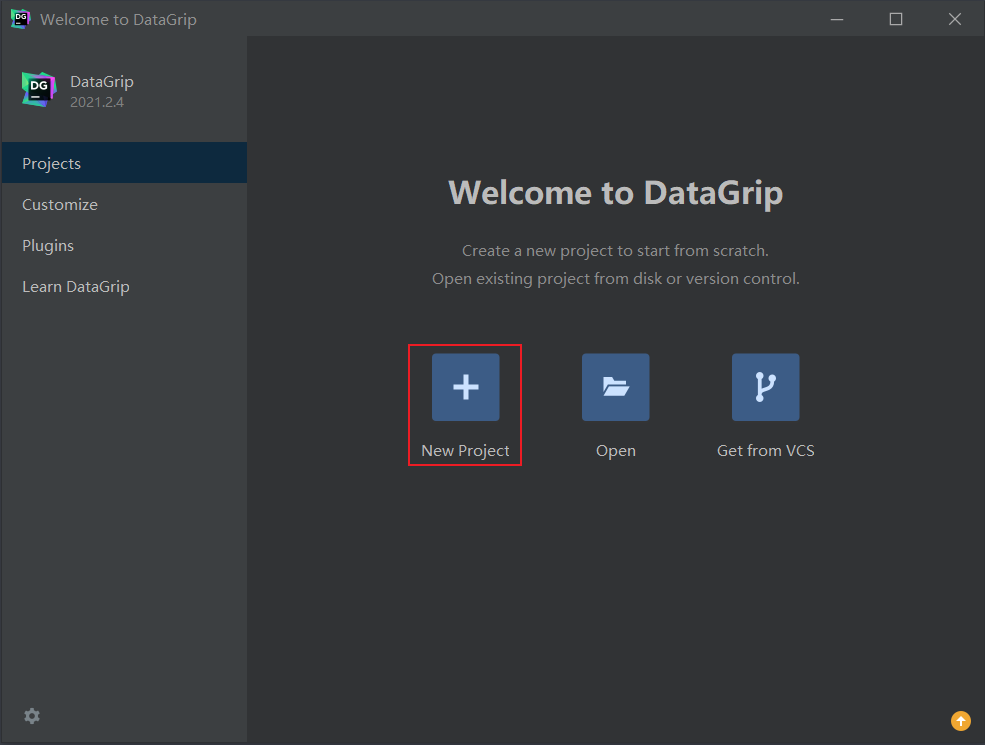  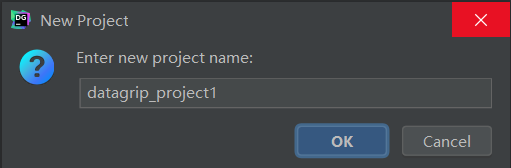 

  

### 3. 优化

进入dataGrip之后，将资料中准备好的eval-reset插件拖入dataGrip直接进行安装

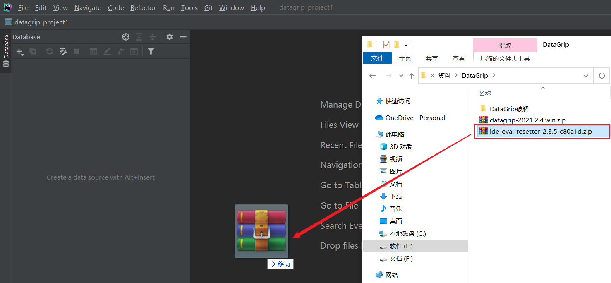  

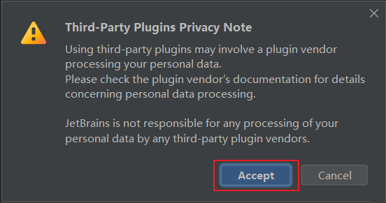 

然后安装完成后, 会提示是否马上重启, 选择 Restart, 重启即可。

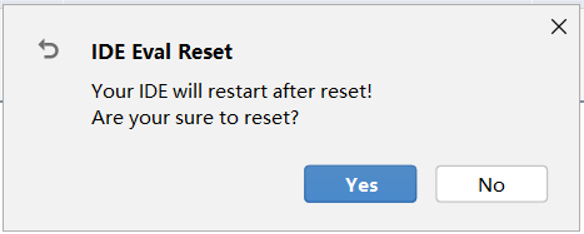  

安装完成后，在Help栏就会出现 Eval Reset 菜单。插件安装完成后，选择Help-->Eval Reset

 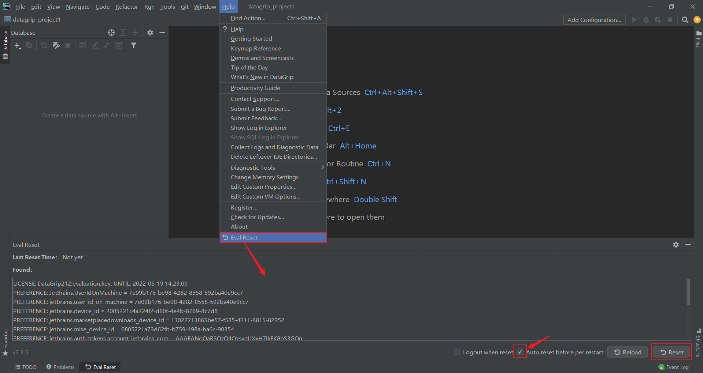 

 

勾选 Auto reset before per restart，此时datagrip会在每一次重启之前，重置试用时间， 从而无限次试用。

 

### 4. 配置

#### 4.1 配置主题颜色

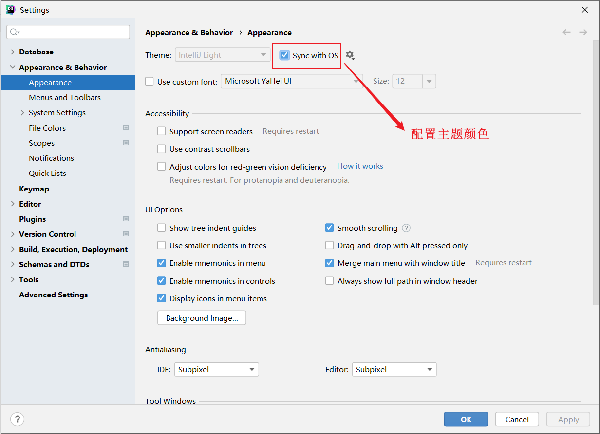 

#### 4.2 连接MySQL

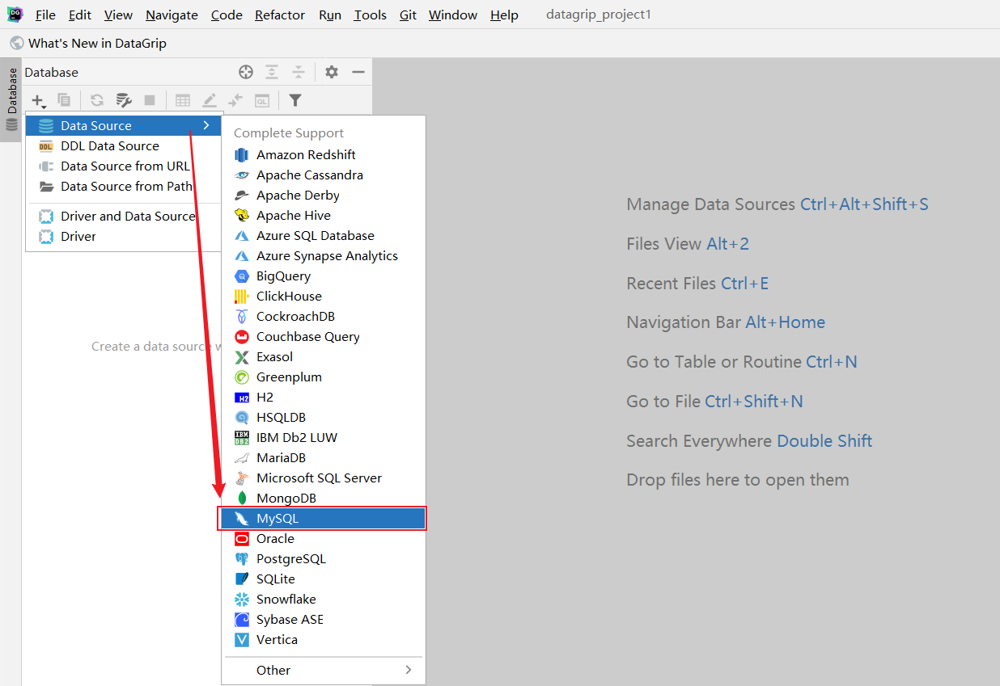 

输入comment备注信息 ; 输入连接的Host主机地址,默认localhost;输入用户名,默认root ;输入密码 , 安装mysql的时候, 设置的mysql的访问密码 。

然后点击 Download 下载数据库连接驱动。

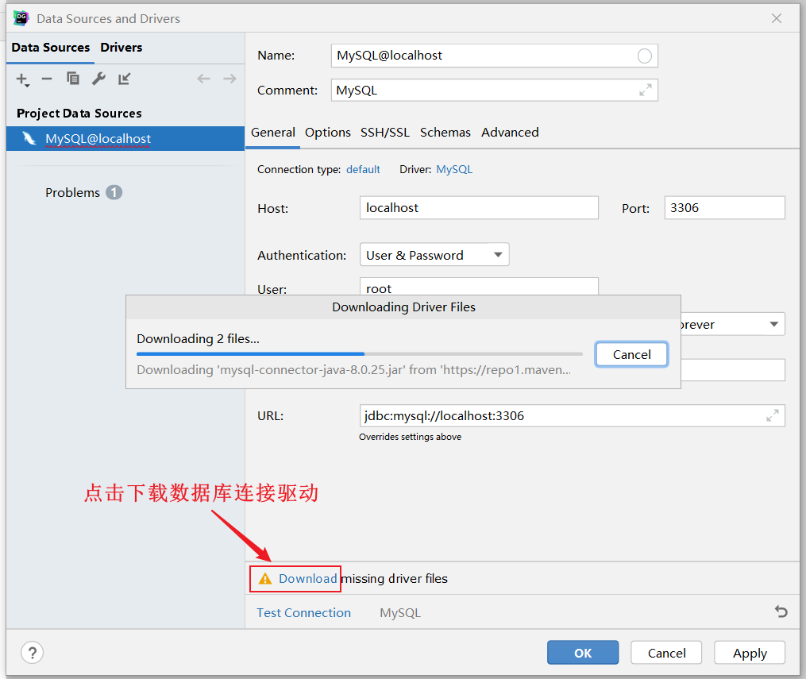 

驱动下载完成之后， 点击 Test Connection。 如果显示 Successed 就说明连接成功了。 然后点击 OK 按钮，连接数据库。

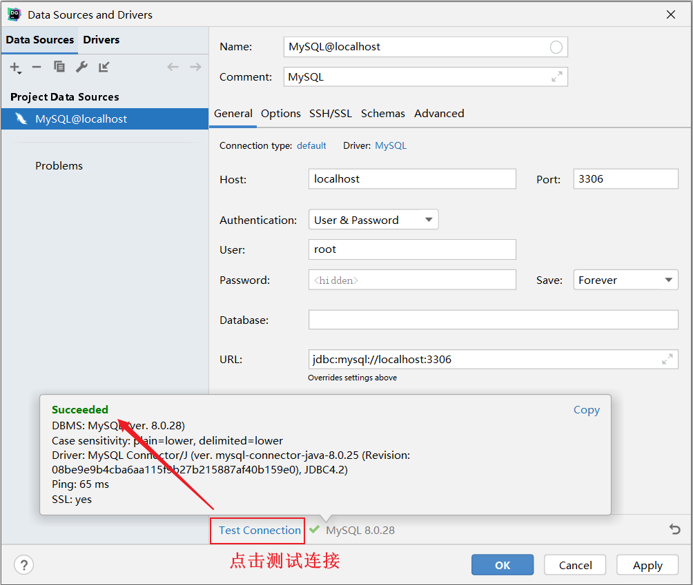 

#### 4.3 展示所有数据库

默认情况下 ， 连接上了MySQL数据库之后， 数据库并没有全部展示出来。 需要选择要展示哪些数据库。

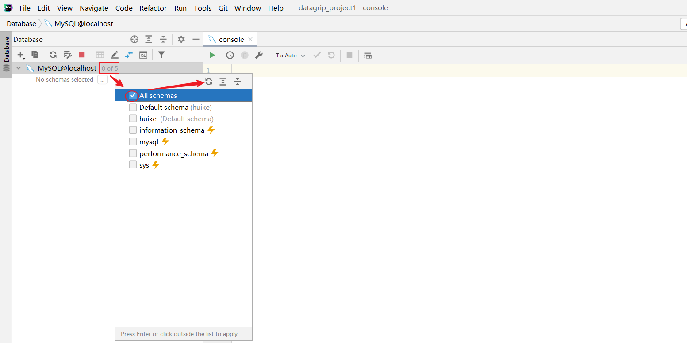 

